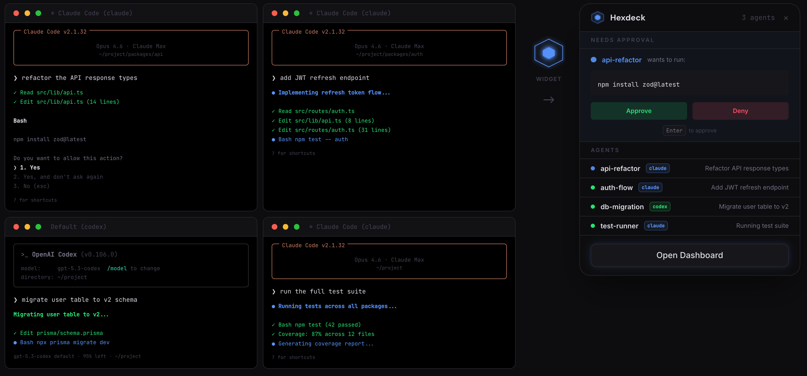

  <picture>
    <source media="(prefers-color-scheme: dark)" srcset=".github/assets/hexdeck-mark.svg">
    
  </picture>

<h3 align="center">Hexdeck</h3>

Real-time observability for AI coding agents

  
  

---

Hexdeck reads local session logs from [Claude Code](https://docs.anthropic.com/en/docs/claude-code) and [Codex](https://github.com/openai/codex), parses them into structured turn-by-turn data, and serves a live dashboard showing what your agents are doing in real time.

  

## How sessions flow into Hexdeck

Any tool that writes session logs — Claude Code, Codex, or both — streams into the same dashboard.

  

## Features

- **Live dashboard** — real-time view of all active agents, updated every second via SSE
- **Plan tracking** — see each agent's current task list and overall workstream progress
- **File overlap detection** — see when two agents are working on the same uncommitted file
- **Risk analytics** — context usage, error rates, spinning signals, compaction proximity, cost per session
- **Intent mapping** — track what agents intend to do vs. what they're actually doing
- **Live feed** — event stream of commits, errors, compactions, and plan changes across all projects

## Floating widget

Hexdeck runs as a floating hexagon widget on your desktop. It reflects the overall state of your agents at a glance:

- 🔵 **Blue** — an agent needs your approval
- 🟢 **Green** — an agent is actively working
- ⚪ **Grey** — no active agents

Expand the widget to see details, approve or deny tool requests, and open the full dashboard.

  

## Install

[**Download Hexdeck for Mac**](https://hexcore.app/api/download) (Apple Silicon)

Launch from your Applications folder. The floating widget and background server start automatically. The full dashboard is available at [localhost:7433](http://localhost:7433). See the [getting started guide](https://www.hexcore.app/docs/hexdeck/getting-started) for more.

## Privacy

Hexdeck is 100% offline. Zero network requests.

| | What |
|---|---|
| **Reads** | Session transcripts in `~/.claude/projects/` and `~/.codex/sessions/`. Does **not** read source files, env vars, or git credentials. |
| **Writes** | PID file (`~/.hexdeck/server.pid`), config (`~/.hexdeck/`), macOS app data in `~/Library/Application Support/dev.hexdeck.menubar`. |
| **Network** | None. |
| **Telemetry** | None. No analytics, usage metrics, or tracking. |

## Contributing

See [CONTRIBUTING.md](CONTRIBUTING.md) for development setup and guidelines.

## License

[MIT](LICENSE)
